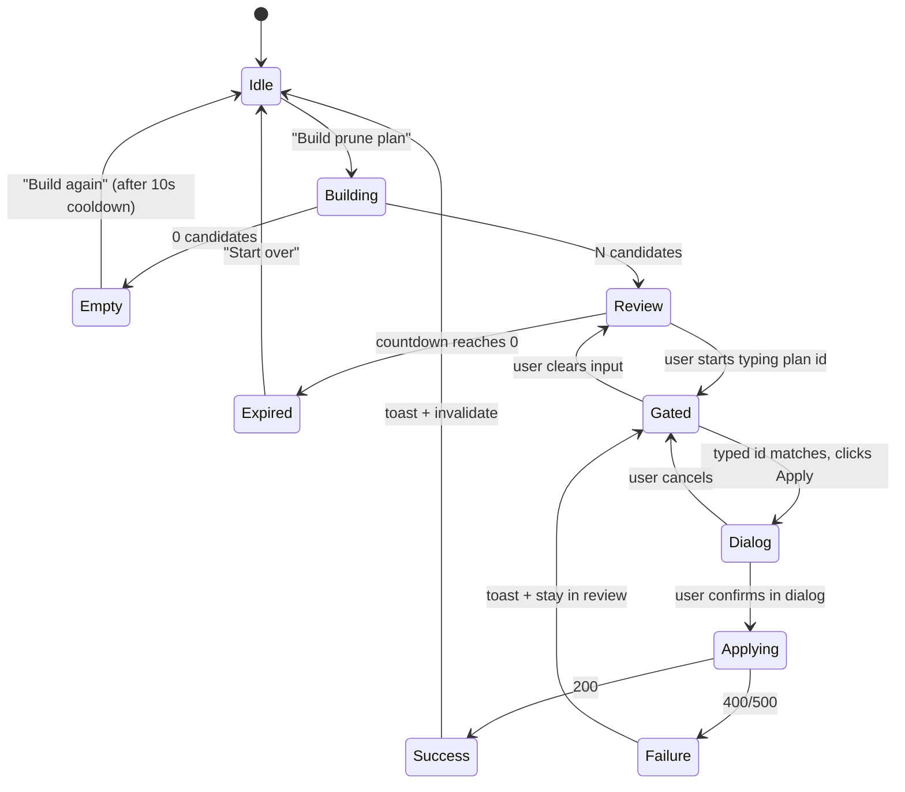

# Memory Cockpit UI — Brain Observatory

| Field | Value |
|---|---|
| **Status** | Draft — awaiting user review |
| **Date** | 2026-04-10 |
| **Spec ID** | `2026-04-10-memory-cockpit-ui-design` |
| **Branch** | `feature/agent-memory-os` |
| **Phase** | UI build on top of green backend |
| **Stack** | Next.js 15 App Router, React 19, TypeScript 5.9, Tailwind v4, TanStack Query v5, react-force-graph-2d, Zod, Vitest + Testing Library |
| **Touches** | `ui/` entirely (scaffold exists but is cosmetic) |
| **Depends on** | `2026-04-10-memory-os-backend-hardening-design.md` — backend MUST be green (tag `p1-api-green`) |
| **Author** | Claude (brainstormed with JR) |

---

## The Problem

The backend now exposes a full memory OS surface — behavioral tiering, safe prune, structured pressure, typed KB slices, detail+neighbors, bounded resume, one-shot backfill — behind seven new REST endpoints. The UI currently lives in `ui/` as an untracked 599-line scaffold: a single Next.js page that polls three endpoints every 5 seconds and renders a canvas-based circular graph (not force-directed), a "KB panel" that is literally four `<chip>` elements saying "project: general, agent: claude-code, nodes: 0, links: 0", and `<pre>` dumps of the handoff/pressure strings. It is a *foundation*, not a cockpit.

The CONTINUE_PROMPT's stated vision is "a Brain + KB cockpit that feels alive, dynamic, and worthy of being the visual operating system for an AI memory substrate" — "a living brain, a memory observatory, a knowledge cockpit, a continuity console." The current scaffold doesn't earn any of those adjectives. It renders zero of the five review-fix endpoints. It has no node details drawer, no prune safety UI, no structured pressure gauges, no curated KB view. It uses `setInterval(load, 5000)` with hand-rolled fetch and no caching, no optimistic updates, and no loading states beyond "refreshing".

This spec rebuilds the UI on top of the hardened backend so that every endpoint is first-class, every safety rule is surfaced to the user (especially the prune apply flow), and the visual language actually honors the "observatory" metaphor. Four dedicated surfaces (Brain / KB / Continuity / Hygiene) each optimized for its own data model, routed via Next.js App Router so URLs are deep-linkable. A shared shell carries the project switcher, health badge, and navigation. One data layer (TanStack Query) for all of them with sensible polling, caching, and mutation optimism. One design system (Brain Observatory — cinematic dark + aurora bloom + serif gravity) applied consistently.

Crucially: the prune apply flow must be safer than the REST endpoint alone. The user must have a clear, undoable, un-surprise-able path between "I want to clean up" and "N memories were deleted." The UI's job is to make the backend's plan-id gate *felt*, not just *enforced*.

---

## Goals

1. **Deliver four fully functional surfaces** — Brain / KB / Continuity / Hygiene — each with its own data model, route, loading/empty/error states, and tests.
2. **Honor the Brain Observatory visual direction** — cinematic dark, aurora mesh bloom behind the brain canvas, serif gravity on page headings, mono discipline on data labels, no devtools vibes.
3. **Ship a force-directed brain graph with node details drawer** — real force simulation via react-force-graph-2d, click-to-open drawer, tier/type visual encoding, neighbor highlighting, pulse on data refresh.
4. **Make the prune apply flow safer than the endpoint alone** — plan review, typed-plan-id confirmation, destructive emphasis, optimistic node removal, toast with undo hint (even though the backend does not support undo).
5. **Use TanStack Query for all data** — polling per-surface, cache invalidation on mutations, optimistic updates where safe, retry policies, loading skeletons.
6. **Be testable** — Vitest + Testing Library with 1-2 meaningful tests per surface (not string smoke checks). Contract tests that validate the Zod schemas match a captured fixture of each endpoint response.
7. **Run alongside the backend with `npm run dev`** — no extra infra, no new services.

## Non-goals

- **No authentication** — the backend assumes trusted localhost.
- **No editing of memories from the UI** — strictly read-only. Mutations are limited to `/api/memory/prune/apply`, `/api/memory/lifecycle/backfill` (admin action), and nothing else.
- **No mobile layout** — desktop cockpit only. Minimum viewport width 1024px. A responsive degradation below 1024 is acceptable but not optimized.
- **No WebSocket or SSE streaming** — polling via TanStack Query is sufficient.
- **No prune plan history / audit log** — plans are ephemeral by design (15-min TTL).
- **No light mode** — dark-first, no toggle. The observatory is a dark room by definition.
- **No multi-project comparison views** — one project in scope at a time.
- **No search/filter on the brain graph** — click the node, use the drawer. Search can come later.
- **No in-UI memory creation** — use MCP tools (`observe`, `save_memory`) for that.

---

## Architecture

### Stack decisions (locked)

| Concern | Choice | Rejected | Why |
|---|---|---|---|
| Router | Next.js 15 App Router | Pages Router, single-page tabs | Real URLs, per-route loading states, server components where useful |
| State/data | `@tanstack/react-query` v5 | SWR, plain fetch + setInterval | Polling, cache invalidation, optimistic mutations, retry policies |
| Graph engine | `react-force-graph-2d` | d3-force raw, Cytoscape.js, custom canvas | React-friendly, canvas-backed (fast), node click/hover, up to 2k nodes |
| Styling | Tailwind v4 + CSS variables | Tailwind v3, styled-components, CSS modules | v4 is current, tokens via CSS vars, design-system driven |
| Runtime validation | Zod at API boundary | io-ts, superstruct, none | Small, idiomatic, parses into typed objects, cheap to maintain |
| Icons | `lucide-react` | Heroicons, custom SVGs, emojis | Consistent stroke width, huge catalog, tree-shakeable |
| Toasts | `sonner` | Roll our own, react-hot-toast | 4KB, accessible, styled, one line to use |
| Testing | Vitest + Testing Library | Jest, Playwright for unit | Vitest is fast, matches scaffold, RTL for behavioral assertions |
| Fonts | Self-hosted via `next/font` | Google Fonts CDN | No FOUT, no CLS, offline-friendly |
| Animations | CSS + Framer Motion v11 | CSS only, React Spring | CSS for micro, Framer for entrance/layout, stays reduced-motion aware |

### Four routes + shared shell

```
/
├── layout.tsx                     # RootLayout: providers, fonts, <Toaster />, starfield
├── page.tsx                       # redirects to /brain
├── brain/
│   ├── page.tsx                   # Brain surface (client component)
│   └── loading.tsx                # skeleton: empty graph + header
├── kb/
│   ├── page.tsx                   # KB surface
│   └── loading.tsx
├── continuity/
│   ├── page.tsx                   # Continuity surface
│   └── loading.tsx
└── hygiene/
    ├── page.tsx                   # Hygiene surface
    └── loading.tsx
```

The root layout renders a `CockpitShell` component around the `children` slot. Shell contains:
- **Sidebar (fixed left, 240px wide)**: Logo/brand mark, four nav items (Brain/KB/Continuity/Hygiene), project switcher combobox at bottom, health badge at very bottom
- **Top header (sticky, 56px tall)**: current page title (serif), breadcrumb if applicable, "last refreshed" timestamp in mono, manual refresh button
- **Main content area (flex-1)**: the route's page.tsx renders here

The project switcher is a single client-side state (`useProjectStore`) — Zustand, not React Query, because it's UI state not server state. Changing project invalidates every query via `queryClient.invalidateQueries({ predicate: q => q.queryKey.includes(oldProject) })`.

### Data flow

```mermaid
graph TD
    subgraph UI["Next.js App Router"]
        Shell[CockpitShell]
        BrainPage[/brain]
        KbPage[/kb]
        ContinuityPage[/continuity]
        HygienePage[/hygiene]
    end

    subgraph Queries["TanStack Query hooks (ui/lib/queries/)"]
        useHealth
        useBrainGraph
        useMemoryDetail
        useKb
        useResume
        usePressure
        usePrunePlan[usePrunePlanMutation]
        usePruneApply[usePruneApplyMutation]
        useBackfill[useBackfillMutation]
    end

    subgraph Clients["Typed clients (ui/lib/api/)"]
        getHealth
        getGraph
        getDetail
        getKb
        getResume
        getPressure
        postPlan
        postApply
        postBackfill
    end

    subgraph Backend["http://localhost:8000"]
        E1[/health]
        E2[/api/memory/graph]
        E3[/api/memory/detail/:id]
        E4[/api/memory/kb]
        E5[/api/memory/resume]
        E6[/api/memory/pressure]
        E7[/api/memory/prune/plan]
        E8[/api/memory/prune/apply]
        E9[/api/memory/lifecycle/backfill]
    end

    Shell --> useHealth
    BrainPage --> useBrainGraph
    BrainPage --> useMemoryDetail
    KbPage --> useKb
    ContinuityPage --> useResume
    HygienePage --> usePressure
    HygienePage --> usePrunePlan
    HygienePage --> usePruneApply
    HygienePage --> useBackfill

    useHealth --> getHealth --> E1
    useBrainGraph --> getGraph --> E2
    useMemoryDetail --> getDetail --> E3
    useKb --> getKb --> E4
    useResume --> getResume --> E5
    usePressure --> getPressure --> E6
    usePrunePlan --> postPlan --> E7
    usePruneApply --> postApply --> E8
    useBackfill --> postBackfill --> E9
```

Each typed client function:
1. Builds the URL with query params
2. Calls `fetch` with a signal (AbortController-compatible)
3. Parses the response body with a Zod schema
4. Returns the parsed object or throws a typed error

Each query hook wraps its client function with a `useQuery` or `useMutation` call, applies per-surface polling settings, and owns cache invalidation for related queries.

### Polling strategy

| Query | `refetchInterval` | `staleTime` | Notes |
|---|---|---|---|
| `useHealth` | 10s | 5s | Low priority, lives in shell |
| `useBrainGraph` | 5s | 2s | Primary Brain polling, pulses on refresh |
| `useMemoryDetail` | off | 30s | Fetched on drawer open, cached per memory_id |
| `useKb` | off (focus-only) | 60s | Rarely changes; refetches on window focus |
| `useResume` | 30s | 15s | Continuity slice — moderate cadence |
| `usePressure` | off (manual) | 30s | Hygiene snapshot is on-demand |
| Mutations | n/a | n/a | `onSuccess` invalidates affected queries |

`refetchOnWindowFocus: true` at the QueryClient level. `retry: 2` with exponential backoff. No `refetchOnReconnect` (cockpit runs on same host).

---

## Design System (Brain Observatory)

### Palette (dark-first, CSS custom properties)

```css
:root {
  /* Backgrounds — cinematic dark, no pure #000 */
  --bg-deep: #020617;         /* the void */
  --bg-base: #0a0f1f;         /* the cockpit floor */
  --bg-elevated: #0f172a;     /* cards / panels */
  --bg-frost: rgba(15, 23, 42, 0.72);  /* glassmorphism with backdrop-blur */

  /* Surfaces — subtle layered opacities for hover/pressed */
  --surface-0: rgba(148, 163, 184, 0.03);
  --surface-1: rgba(148, 163, 184, 0.06);
  --surface-2: rgba(148, 163, 184, 0.09);
  --border: rgba(148, 163, 184, 0.12);
  --border-strong: rgba(148, 163, 184, 0.24);

  /* Foreground — light-on-dark */
  --fg: #f1f5f9;              /* primary text */
  --fg-muted: #94a3b8;        /* secondary */
  --fg-dim: #64748b;          /* tertiary */
  --fg-serif: #f8fafc;        /* display headings (slightly brighter) */

  /* Accents */
  --accent-primary: #60a5fa;      /* brain pulse blue */
  --accent-secondary: #a78bfa;    /* aurora purple */
  --accent-danger: #f87171;       /* destructive */
  --accent-warning: #f59e0b;      /* caution */
  --accent-success: #34d399;      /* positive */

  /* Tier colors — identity gets gold because it is sacred */
  --tier-identity: #fbbf24;
  --tier-semantic: #a78bfa;
  --tier-episodic: #60a5fa;
  --tier-working: #94a3b8;

  /* Memory type colors (used for graph nodes and badges) */
  --type-fact: #60a5fa;
  --type-decision: #f59e0b;
  --type-preference: #c084fc;
  --type-learning: #34d399;
  --type-requirement: #f87171;
  --type-note: #94a3b8;
  --type-session: #cbd5e1;

  /* Aurora mesh gradient stops (behind brain canvas) */
  --aurora-1: rgba(96, 165, 250, 0.18);
  --aurora-2: rgba(167, 139, 250, 0.14);
  --aurora-3: rgba(34, 211, 238, 0.10);

  /* Motion */
  --ease-out-quint: cubic-bezier(0.22, 1, 0.36, 1);
  --ease-expo-out: cubic-bezier(0.16, 1, 0.3, 1);
  --dur-fast: 150ms;
  --dur-med: 280ms;
  --dur-slow: 420ms;
  --dur-breath: 4s;

  /* Radii and spacing */
  --radius-sm: 8px;
  --radius-md: 12px;
  --radius-lg: 18px;
  --radius-xl: 24px;

  /* Z-index scale */
  --z-shell: 10;
  --z-drawer: 40;
  --z-modal: 60;
  --z-toast: 80;
}
```

All colors meet WCAG AA (4.5:1 for body text) on the cockpit backgrounds. Tier colors pass 4.5:1 on `--bg-elevated`. Borders use rgba opacities so they adapt cleanly to layered surfaces.

### Typography

```css
/* Self-hosted via next/font — no runtime download */
--font-serif: 'IBM Plex Serif', Georgia, serif;  /* page titles + display */
--font-sans: 'Inter', system-ui, sans-serif;      /* body + labels */
--font-mono: 'JetBrains Mono', 'SF Mono', monospace;  /* data + IDs */

/* Type scale */
--text-hero: clamp(2rem, 3.5vw, 2.75rem);   /* serif, line-height 1.1 */
--text-title: 1.5rem;                        /* serif, line-height 1.2 */
--text-h3: 1.125rem;                         /* sans-semibold */
--text-body: 0.9375rem;                      /* sans-regular, line-height 1.6 */
--text-label: 0.75rem;                       /* sans-medium, uppercase, tracking 0.08em */
--text-mono: 0.8125rem;                      /* mono-regular, tabular-nums */
```

Usage discipline:
- **Serif** ONLY on page titles and section dividers (`<h1>`, `<h2>` where semantic). Never on body.
- **Sans** for everything readable: body text, buttons, form labels, menu items.
- **Mono** with `font-variant-numeric: tabular-nums` for anything with numeric columns, plan ids, memory ids, timestamps. Never for prose.

### Motion

- **Micro-interactions** (button hover/press, nav highlight): 150ms ease-out-quint
- **Drawer / modal entrance**: 280ms ease-expo-out, backdrop fades in 180ms
- **Drawer / modal exit**: 200ms (65% of entrance, per Material guidance)
- **Brain canvas pulse**: 500ms fade on data arrival (opacity 0.8 → 1.0)
- **Aurora background breathing**: 4s infinite linear, `background-position` shift ±2% + `hue-rotate(0 → 8deg → 0)`
- **Reduced motion**: when `prefers-reduced-motion: reduce`, aurora breathing and pulse are disabled, transitions collapse to 0ms, force simulation still runs (necessary for layout) but node entrance is instant

### Effects

- **Glassmorphism panels** (drawer, modal, sidebar): `background: var(--bg-frost); backdrop-filter: blur(18px) saturate(1.2); border: 1px solid var(--border);`
- **Aurora background** (Brain page only): full-bleed `<div>` with CSS mesh gradient (conic + radial layered) sitting behind the canvas
- **Starfield** (Brain page only): CSS-generated via box-shadow multiple pseudo-element dots. Total size ~800 bytes. Opts out on reduced-motion.
- **Node glow** (force graph): per-node radial shadow, color tied to `--type-*`, intensity tied to `durability` (from backend)

### Anti-patterns (from ui-ux-pro-max)

- No emoji icons — use `lucide-react`
- No `#000000` — minimum `#020617`
- No `display: none` for disabled states — use opacity 0.38 + `pointer-events: none`
- No placeholder-only labels — every input has a visible label
- No icon-only nav items — every nav row has text + icon
- No layout-shifting press states — use transform/opacity only
- No raw hex in components — everything via `var(--token)`

---

## Components

The components folder is organized by responsibility, not by technical layer.

```
ui/
├── app/                           # App Router routes (one folder per surface)
│   ├── layout.tsx
│   ├── page.tsx                   # → redirect('/brain')
│   ├── brain/page.tsx
│   ├── brain/loading.tsx
│   ├── kb/page.tsx
│   ├── kb/loading.tsx
│   ├── continuity/page.tsx
│   ├── continuity/loading.tsx
│   ├── hygiene/page.tsx
│   ├── hygiene/loading.tsx
│   └── globals.css                # tokens, fonts, reset, aurora keyframes
│
├── components/
│   ├── shell/
│   │   ├── cockpit-shell.tsx      # wraps {children}, composes sidebar + header
│   │   ├── sidebar-nav.tsx        # fixed-left nav with 4 items
│   │   ├── header-bar.tsx         # sticky top, title, refresh
│   │   ├── project-switcher.tsx   # combobox (lucide: folder-git)
│   │   └── health-badge.tsx       # green dot + "online" mono
│   │
│   ├── brain/
│   │   ├── brain-canvas.tsx       # wraps react-force-graph-2d
│   │   ├── brain-scene.tsx        # aurora bg + starfield + canvas
│   │   ├── node-drawer.tsx        # right-side drawer with memory detail
│   │   ├── tier-legend.tsx        # compact legend for node colors/sizes
│   │   ├── type-legend.tsx        # memory type → color chip
│   │   └── graph-stats.tsx        # mono counter: N nodes · M edges · refreshed 00:00
│   │
│   ├── kb/
│   │   ├── kb-columns.tsx         # 4-column grid of slices
│   │   ├── kb-slice.tsx           # one slice: Decisions / Requirements / ...
│   │   ├── kb-entry.tsx           # one memory row (collapsible)
│   │   └── kb-empty.tsx           # empty state per slice
│   │
│   ├── continuity/
│   │   ├── resume-header.tsx      # project + agent + scope metadata
│   │   ├── important-section.tsx  # important memories list
│   │   ├── recent-section.tsx     # recent memories timeline
│   │   ├── next-steps-list.tsx    # bullet list of extracted next steps
│   │   ├── conflicts-panel.tsx    # unresolved contradictions
│   │   └── truncated-warning.tsx  # shown if packet.truncated
│   │
│   ├── hygiene/
│   │   ├── pressure-gauges.tsx    # load_score + capacity + flagged counts
│   │   ├── pressure-explainer.tsx # plain-language "what this means"
│   │   ├── prune-builder.tsx      # "Build plan" button + state
│   │   ├── prune-plan-review.tsx  # full candidate list + countdown
│   │   ├── prune-apply-gate.tsx   # typed-id confirmation + apply button
│   │   ├── prune-apply-dialog.tsx # final confirmation modal
│   │   └── backfill-runner.tsx    # admin card for lifecycle backfill
│   │
│   └── ui/                        # shared primitives (Radix-inspired)
│       ├── button.tsx             # variants: primary, ghost, danger
│       ├── card.tsx               # glass + elevated variants
│       ├── drawer.tsx             # controlled drawer with escape + overlay
│       ├── dialog.tsx             # controlled modal with focus trap
│       ├── badge.tsx              # type/tier badges
│       ├── empty.tsx              # empty-state primitive
│       ├── skeleton.tsx           # loading placeholder
│       ├── mono-label.tsx         # uppercase tracked label in mono
│       └── serif-heading.tsx      # page-title primitive with optional eyebrow
│
├── lib/
│   ├── api/                       # typed clients, one per endpoint
│   │   ├── health.ts
│   │   ├── graph.ts
│   │   ├── detail.ts
│   │   ├── kb.ts
│   │   ├── resume.ts
│   │   ├── pressure.ts
│   │   ├── prune.ts               # plan + apply
│   │   ├── backfill.ts
│   │   └── client.ts              # base fetch + error handling
│   │
│   ├── queries/                   # TanStack Query hooks
│   │   ├── use-health.ts
│   │   ├── use-brain-graph.ts
│   │   ├── use-memory-detail.ts
│   │   ├── use-kb.ts
│   │   ├── use-resume.ts
│   │   ├── use-pressure.ts
│   │   ├── use-prune.ts           # plan + apply mutations
│   │   └── use-backfill.ts
│   │
│   ├── schemas.ts                 # Zod schemas for every endpoint response
│   ├── types.ts                   # inferred types from schemas
│   ├── project-store.ts           # Zustand store for current project
│   ├── query-client.ts            # configured QueryClient instance
│   └── theme.ts                   # design token TS references (for inline styles)
│
├── tests/
│   ├── brain-canvas.test.tsx
│   ├── node-drawer.test.tsx
│   ├── kb-columns.test.tsx
│   ├── continuity.test.tsx
│   ├── pressure-gauges.test.tsx
│   ├── prune-flow.test.tsx        # keystone: plan → review → apply gate → dialog
│   ├── schemas.test.ts            # Zod parse-round-trip against fixtures
│   └── fixtures/                  # captured real responses (renamed from any /general → /test)
│       ├── health.json
│       ├── graph.json
│       ├── kb.json
│       ├── pressure.json
│       └── prune-plan.json
│
├── public/
│   └── fonts/                     # self-hosted IBM Plex Serif, Inter, JetBrains Mono
│
├── package.json
├── next.config.ts
├── tsconfig.json
├── vitest.config.ts
└── tailwind.config.ts             # v4 — thin, since most tokens are CSS vars
```

---

## Surface specifications

### 1. Brain surface (`/brain`)

**Purpose:** Central memory constellation. The graph is the hero. Everything else is peripheral.

**Layout:**
- Full-bleed `brain-scene` component as the background (absolute inset-0, z-0)
- Aurora mesh gradient layer (z-1) with 4s breathing animation
- Faint CSS starfield (z-2)
- `brain-canvas` component (react-force-graph-2d) filling the viewport minus shell (z-3)
- Top-right: `graph-stats` pill (mono: "137 nodes · 412 edges · refreshed 14:32:11")
- Bottom-left: `tier-legend` + `type-legend` chip rows
- On node click: `node-drawer` slides in from the right (z-40)

**Data:**
- `useBrainGraph(project)` → `/api/memory/graph?project=...&limit=400`
- `useMemoryDetail(memoryId)` → `/api/memory/detail/{id}` (enabled only when drawer open)

**Node visual encoding:**
- Radius = 4 + `durability` * 10 (durability from backend lifecycle)
- Fill = `--type-<memory.type>`
- Border = `--tier-<memory.tier>` if tier ≠ working (working tier = no border)
- Glow = `box-shadow 0 0 <radius>px <type-color> opacity 0.4`
- Pulse: when new data arrives, nodes flash opacity 0.6 → 1.0 over 500ms

**Edge visual encoding:**
- Stroke width = 0.5 + `weight` (from graph API)
- Color = `--fg-dim` with 0.4 opacity for `related_to`
- Color = `--accent-danger` with 0.6 opacity for `contradicts`
- Color = `--accent-primary` with 0.5 opacity for `supersedes`

**Interactions:**
- Click node → fetch detail + open drawer, highlight selected node + its 1-hop neighbors
- Hover node → show a compact tooltip (content preview 80 chars, type, tier)
- Scroll wheel → zoom
- Drag background → pan
- ESC → close drawer + clear highlight

**Drawer content:**
- Header: memory type badge + tier badge + `memory_id` in mono
- Serif title: first 120 chars of content
- Full content (sans)
- Metadata row: `date`, `reinforcement_count`, `durability`, `salience` (if present)
- Neighbors section: list of related memories with relation type, click to navigate
- If `count_contradicts > 0`: warning banner in `--accent-danger`
- Close button (top-right) + ESC

**Empty state:** serif "No memories in this project yet" + small "Try `observe()` from your agent" helper line.

**Loading state:** `brain-scene` renders with 12 placeholder nodes animating gently; no stats.

### 2. KB surface (`/kb`)

**Purpose:** Curated semantic view of the project's durable knowledge. Not a dashboard — a library.

**Layout:**
- Page title (serif): "Knowledge Base · <project>"
- Eyebrow (mono uppercase): "CURATED BY TYPE · LIVE"
- 4-column grid (`kb-columns`): Decisions · Requirements · Preferences · Learnings
- Each column is a `kb-slice` with its own header chip, count, and vertical feed of `kb-entry` items
- One entry can be expanded at a time (accordion pattern) to show full content + metadata

**Data:**
- `useKb(project)` → `/api/memory/kb?project=...`
- Returns `{ decisions: [...], requirements: [...], preferences: [...], learnings: [...] }`

**kb-entry visual:**
- Collapsed: date (mono, dim) · summary (sans, 120 chars) · tier badge
- Expanded: full content (sans, line-height 1.6) + mono metadata row + fade-down animation

**Column headers:**
- Serif "Decisions" / "Requirements" / "Preferences" / "Learnings"
- Mono count: `· 18`
- Color accent on the left border of each column: decisions=amber, requirements=red, preferences=purple, learnings=green

**Empty slices:** Each empty slice renders a muted serif "—" with helper "no decisions yet".

**Interactions:** click entry to toggle expanded. One at a time per column. No cross-column state.

### 3. Continuity surface (`/continuity`)

**Purpose:** Startup console. What a fresh agent needs to re-enter the project.

**Layout:**
- Page title (serif): "Continuity · <project>"
- Eyebrow: "WHAT TO LOAD ON SESSION START"
- Top card: `resume-header` — scope metadata (agent, repo, branch, trust_boundary) in mono
- If `packet.truncated`: `truncated-warning` banner at top
- Three columns below (responsive to two on <1280px):
  - `important-section` — top 12 important memories by durability, rendered as serif cards
  - `recent-section` — top 12 recent memories, rendered as a vertical timeline with date markers
  - `conflicts-panel` — unresolved contradictions (0 in most projects — show "All clear" when empty)
- Bottom: `next-steps-list` — bulleted list of extracted next steps, serif

**Data:**
- `useResume(project)` → `/api/memory/resume?project=...`

**Empty state:** serif "Fresh project. Nothing to continue from."

### 4. Hygiene surface (`/hygiene`)

**Purpose:** Memory hygiene operations. The ONLY surface that can mutate state.

**Layout:**
- Page title (serif): "Memory Hygiene · <project>"
- Eyebrow: "PRESSURE · PRUNE · BACKFILL"
- Section 1 — **Pressure snapshot** (`pressure-gauges`):
  - Three horizontal gauges: `load_score` (0.0–1.0), `capacity` (total memories), `flagged` (stale + low-value + contradictions)
  - Below each: mono metric + muted label
  - Plain-language explainer: "This project is {quiet|active|saturated}. N memories are candidates for prune."
- Section 2 — **Prune plan** (`prune-builder` → `prune-plan-review` → `prune-apply-gate` → `prune-apply-dialog`):
  - Initial state: serif "Build a prune plan" + mono "max 200 candidates" + primary button
  - On build → `usePrunePlanMutation` → shows `prune-plan-review`:
    - Header: plan_id in mono (selectable) + countdown timer (15:00 → 00:00)
    - Candidate table: memory_id · tier · reason · age · salience (mono)
    - Empty-plan case: serif "Nothing to prune. Pressure is low."
    - Below the table: `prune-apply-gate`:
      - Danger banner (`--accent-danger` border) explaining "N memories will be permanently deleted"
      - Input: "Type the plan id to confirm" — mono input, placeholder shows the plan id as `xxxx…` (first 4 chars of real plan id)
      - Apply button: disabled until typed input === plan id; when enabled, button is `--accent-danger`
      - Clicking Apply opens `prune-apply-dialog` — modal with:
        - Serif title: "Delete N memories?"
        - Mono summary: counts by tier (`working: 18, episodic: 2`)
        - Two buttons: "Cancel" (ghost) and "Delete N memories" (danger)
    - On final confirm → `usePruneApplyMutation`:
      - Optimistic: dialog closes, toast "Deleting N memories…"
      - On success: toast "Deleted N. Skipped M." + invalidate brain graph + pressure
      - On failure: toast with error, plan review stays open
- Section 3 — **Lifecycle backfill** (`backfill-runner`):
  - Card with serif "One-shot backfill"
  - Explainer: "Compute tier / durability for every existing memory. Safe. Idempotent."
  - Two buttons: "Dry run" and "Apply" (both ghost, apply is disabled until dry run succeeds)
  - Shows report inline: mono `{working: 42, episodic: 8, semantic: 3, identity: 0}`

**Data:**
- `usePressure(project)` → `/api/memory/pressure?project=...`
- `usePrunePlanMutation(project, limit)` → `POST /api/memory/prune/plan`
- `usePruneApplyMutation(plan_id, confirm)` → `POST /api/memory/prune/apply`
- `useBackfillMutation(dry_run, project)` → `POST /api/memory/lifecycle/backfill`

**Safety rules enforced by the UI on top of backend:**
1. Apply button is **always** disabled until the typed plan id exactly matches the real plan id (strict equality, case-sensitive, no trim)
2. Apply requires a second confirmation via the modal dialog (two-step)
3. Countdown timer visually reaches 0 and disables the whole flow — user must rebuild
4. After apply, the plan is gone from state — no "apply again"
5. Destructive styling throughout — danger color, not muted

---

## Prune flow UX — the keystone

This flow is what the whole C1 fix from the backend exists for. The user experience must match the backend's strictness.



**The apply button has four states:**

| State | Visual | Interactable | When |
|---|---|---|---|
| `disabled` | Ghost border, muted text, `cursor-not-allowed` | No | Typed input ≠ plan id (default) |
| `primed` | Solid `--accent-danger`, white text, pulse shadow | Yes | Typed input === plan id |
| `loading` | Solid danger, spinner, "Deleting…" | No | Mutation in flight |
| `expired` | Muted gray, strikethrough, "Plan expired" | No | Countdown ≤ 0 |

**Toasts:**
- On plan build success: neutral toast "Plan `xxxx…` built. N candidates. Expires 15m."
- On plan build empty: neutral toast "Nothing to prune."
- On apply success: success toast "Deleted N memories. Skipped M." (4s auto-dismiss)
- On apply failure: danger toast with `result.error` (8s, manual dismiss)
- On plan expired: warning toast "Plan expired. Build a new one." (5s)

**Accessibility:**
- The typed confirmation input has `aria-describedby` pointing to the danger banner
- The apply dialog traps focus, ESC closes, "Cancel" is default-focused
- Toasts use `aria-live="polite"` except errors which use `aria-live="assertive"`
- The countdown timer has `aria-live="off"` (would be too noisy) but has a screen-reader-only paragraph that updates every 60s

---

## Data schemas (Zod)

Every endpoint response is parsed through a Zod schema at the client boundary. These live in `ui/lib/schemas.ts`:

```typescript
import { z } from 'zod';

export const HealthSchema = z.object({
  status: z.string(),
  transport: z.string().optional(),
  tools_enabled: z.array(z.string()).optional(),
});

export const MemorySchema = z.object({
  memory_id: z.string(),
  content: z.string().optional(),
  type: z.string().optional(),
  tier: z.enum(['working', 'episodic', 'semantic', 'identity']).optional(),
  durability: z.number().optional(),
  reinforcement_count: z.number().optional(),
  lifecycle_reason: z.string().optional(),
  date: z.string().optional(),
  project: z.string().optional(),
  salience: z.number().optional(),
});

export const GraphNodeSchema = z.object({
  id: z.string(),
  type: z.string().optional(),
  content: z.string().optional(),
  tier: z.string().optional(),
  durability: z.number().optional(),
  degree: z.number().optional(),
});

export const GraphLinkSchema = z.object({
  source: z.string(),
  target: z.string(),
  weight: z.number().optional(),
  relation: z.string().optional(),
});

export const GraphResponseSchema = z.object({
  graph: z.object({
    nodes: z.array(GraphNodeSchema),
    links: z.array(GraphLinkSchema),
  }).optional(),
});

export const DetailResponseSchema = z.object({
  memory: MemorySchema.nullable(),
  neighbors: z.array(z.object({
    relation: z.string(),
    memory: MemorySchema,
  })),
  scope: z.object({
    project: z.string().nullable().optional(),
    agent: z.string().nullable().optional(),
    repo_name: z.string().nullable().optional(),
  }).nullable(),
});

export const KbEntrySchema = z.object({
  memory_id: z.string().nullable(),
  type: z.string().nullable(),
  tier: z.string().nullable(),
  date: z.string().nullable(),
  summary: z.string(),
  content: z.string().optional(),
});

export const KbResponseSchema = z.object({
  project: z.string(),
  decisions: z.array(KbEntrySchema),
  requirements: z.array(KbEntrySchema),
  preferences: z.array(KbEntrySchema),
  learnings: z.array(KbEntrySchema),
});

export const PressureResponseSchema = z.object({
  project: z.string(),
  load_score: z.number(),
  capacity: z.number(),
  flagged: z.object({
    stale_working_count: z.number(),
    low_value_count: z.number(),
    contradiction_count: z.number(),
  }),
  candidates: z.array(z.record(z.string(), z.any())),
});

export const PruneCandidateSchema = z.object({
  memory_id: z.string(),
  tier: z.string(),
  reason: z.string(),
  age_days: z.number(),
  salience: z.number(),
});

export const PrunePlanSchema = z.object({
  plan_id: z.string(),
  project: z.string(),
  generated_at: z.string(),
  expires_at: z.string(),
  summary: z.string(),
  candidates: z.array(PruneCandidateSchema),
});

export const PruneApplyResponseSchema = z.object({
  plan_id: z.string(),
  deleted: z.array(z.string()),
  skipped: z.array(z.string()),
});

export const BackfillReportSchema = z.object({
  dry_run: z.boolean(),
  project: z.string().nullable(),
  updated_by_tier: z.record(z.string(), z.number()),
  skipped: z.array(z.string()),
  errors: z.array(z.object({ memory_id: z.string(), error: z.string() })),
  total: z.number(),
});

export const ResumeResponseSchema = z.object({
  scope: z.record(z.string(), z.any()),
  recent: z.array(z.any()),
  important: z.array(z.any()),
  unresolved: z.array(z.any()),
  next_steps: z.array(z.any()),
  handoff: z.string().nullable(),
  pressure: z.any(),
  pressure_report: z.string().optional(),
  truncated: z.boolean(),
  summary: z.string().optional(),
});
```

Types are derived via `z.infer<typeof Schema>` and exported from `ui/lib/types.ts`.

---

## Tests

### Unit tests (Vitest + Testing Library)

**`tests/schemas.test.ts`** — contract tests. Each fixture in `tests/fixtures/` is parsed through its Zod schema. These catch backend drift before the UI tries to render bad data.

```typescript
test('HealthSchema parses real health response', async () => {
  const fixture = await readJson('tests/fixtures/health.json');
  expect(HealthSchema.parse(fixture)).toEqual(expect.objectContaining({ status: 'healthy' }));
});

test('GraphResponseSchema parses real graph response', async () => {
  const fixture = await readJson('tests/fixtures/graph.json');
  const parsed = GraphResponseSchema.parse(fixture);
  expect(parsed.graph?.nodes).toBeInstanceOf(Array);
});

// ... one test per schema
```

**`tests/brain-canvas.test.tsx`** — the brain canvas renders nodes and fires click handler.
```typescript
test('clicking a node fires onNodeClick with the memory id', async () => {
  const onNodeClick = vi.fn();
  const nodes = [{ id: 'm1', type: 'decision', content: 'x' }];
  render(<BrainCanvas nodes={nodes} links={[]} onNodeClick={onNodeClick} />);
  // ForceGraph2D uses canvas — we assert via its onNodeClick prop wiring
  // (the component re-exports a mock in test env that bypasses canvas)
  await userEvent.click(screen.getByTestId('force-graph-2d'));
  expect(onNodeClick).toHaveBeenCalledWith('m1');
});
```

**`tests/node-drawer.test.tsx`** — drawer renders memory detail, closes on ESC.
```typescript
test('drawer opens with memory content and closes on escape', async () => {
  const onClose = vi.fn();
  render(<NodeDrawer memory={fakeMemory} neighbors={[]} onClose={onClose} />);
  expect(screen.getByText(fakeMemory.content)).toBeInTheDocument();
  await userEvent.keyboard('{Escape}');
  expect(onClose).toHaveBeenCalled();
});
```

**`tests/kb-columns.test.tsx`** — 4 slices render from a fixture.
```typescript
test('KB columns render four slices from fixture', () => {
  const fixture = kbFixture;
  render(<KbColumns data={fixture} />);
  expect(screen.getByRole('heading', { name: /decisions/i })).toBeInTheDocument();
  expect(screen.getByRole('heading', { name: /requirements/i })).toBeInTheDocument();
  expect(screen.getByRole('heading', { name: /preferences/i })).toBeInTheDocument();
  expect(screen.getByRole('heading', { name: /learnings/i })).toBeInTheDocument();
});
```

**`tests/continuity.test.tsx`** — resume section, truncated banner.
```typescript
test('truncated flag renders a warning banner', () => {
  render(<ContinuityPage data={{ ...fakeResume, truncated: true }} />);
  expect(screen.getByText(/showing recent window/i)).toBeInTheDocument();
});
```

**`tests/pressure-gauges.test.tsx`** — three gauges reflect the load score.
```typescript
test('load score 0.45 renders the gauge at 45 percent', () => {
  render(<PressureGauges data={{ load_score: 0.45, capacity: 100, flagged: { stale_working_count: 0, low_value_count: 45, contradiction_count: 0 } }} />);
  expect(screen.getByRole('meter', { name: /load/i })).toHaveAttribute('aria-valuenow', '0.45');
});
```

**`tests/prune-flow.test.tsx`** — the keystone test. Walks the entire flow: build → review → type id → apply button enables → dialog → confirm → success toast.

```typescript
test('full prune flow: build → review → typed confirmation → dialog → apply', async () => {
  const mockClient = createMockQueryClient({
    prunePlan: fakePlan,
    pruneApply: { plan_id: 'abc', deleted: ['m1', 'm2'], skipped: [] },
  });

  render(
    <QueryClientProvider client={mockClient}>
      <HygienePage project="test" />
    </QueryClientProvider>
  );

  // Initial state: Build button visible
  await userEvent.click(screen.getByRole('button', { name: /build prune plan/i }));

  // After build: candidate list visible
  await waitFor(() => {
    expect(screen.getByText(fakePlan.plan_id)).toBeInTheDocument();
  });

  // Apply button disabled until typed id matches
  const applyButton = screen.getByRole('button', { name: /^apply/i });
  expect(applyButton).toBeDisabled();

  // Type wrong id
  const input = screen.getByLabelText(/type the plan id/i);
  await userEvent.type(input, 'wrong');
  expect(applyButton).toBeDisabled();

  // Clear and type correct
  await userEvent.clear(input);
  await userEvent.type(input, fakePlan.plan_id);
  expect(applyButton).toBeEnabled();

  // Click apply → dialog opens
  await userEvent.click(applyButton);
  expect(screen.getByRole('dialog')).toBeInTheDocument();

  // Confirm in dialog
  await userEvent.click(screen.getByRole('button', { name: /delete 2 memories/i }));

  // Toast fires
  await waitFor(() => {
    expect(screen.getByText(/deleted 2/i)).toBeInTheDocument();
  });
});
```

### Build + lint

- `npm run build` passes (Next.js production build)
- `npm run lint` passes (next lint + eslint-config-next)
- `npm test` runs all Vitest tests (target ≤10s total)

### Out of scope for this spec

- Playwright end-to-end tests against a live backend (can come later)
- Visual regression tests (too high-maintenance at this stage)
- Lighthouse performance audits (we'll eyeball it; real perf work is a followup)

---

## File tree (target end-state)

```
ui/                                 ← the entire directory is rebuilt, old scaffold discarded
├── app/
│   ├── layout.tsx                  ← NEW (replaces current)
│   ├── page.tsx                    ← REWRITE (redirect to /brain)
│   ├── globals.css                 ← REWRITE (tokens + reset + aurora keyframes)
│   ├── brain/page.tsx              ← NEW
│   ├── brain/loading.tsx           ← NEW
│   ├── kb/page.tsx                 ← NEW
│   ├── kb/loading.tsx              ← NEW
│   ├── continuity/page.tsx         ← NEW
│   ├── continuity/loading.tsx      ← NEW
│   ├── hygiene/page.tsx            ← NEW
│   └── hygiene/loading.tsx         ← NEW
├── components/
│   ├── shell/                      ← NEW (5 files)
│   ├── brain/                      ← NEW (6 files; replaces brain-canvas.tsx)
│   ├── kb/                         ← NEW (4 files; replaces kb-panel.tsx)
│   ├── continuity/                 ← NEW (6 files; replaces handoff-panel.tsx)
│   ├── hygiene/                    ← NEW (7 files; replaces pressure-panel.tsx)
│   └── ui/                         ← NEW (primitives — 9 files)
├── lib/
│   ├── api/                        ← NEW (9 files; replaces lib/api.ts)
│   ├── queries/                    ← NEW (8 files)
│   ├── schemas.ts                  ← NEW
│   ├── types.ts                    ← NEW
│   ├── project-store.ts            ← NEW
│   ├── query-client.ts             ← NEW
│   └── theme.ts                    ← NEW
├── tests/
│   ├── schemas.test.ts             ← NEW (contract tests)
│   ├── brain-canvas.test.tsx       ← NEW
│   ├── node-drawer.test.tsx        ← NEW
│   ├── kb-columns.test.tsx         ← NEW
│   ├── continuity.test.tsx         ← NEW
│   ├── pressure-gauges.test.tsx    ← NEW
│   ├── prune-flow.test.tsx         ← NEW
│   ├── fixtures/*.json             ← NEW
│   ├── scaffold.test.ts            ← DELETE
│   └── dashboard.test.ts           ← DELETE
├── public/
│   └── fonts/                      ← NEW (self-hosted woff2)
├── package.json                    ← REWRITE (new deps: @tanstack/react-query, zod, react-force-graph-2d, lucide-react, sonner, framer-motion, tailwindcss@^4, zustand, @testing-library/react, @testing-library/user-event, jsdom)
├── next.config.ts                  ← KEEP / MINOR UPDATE
├── tsconfig.json                   ← KEEP
├── vitest.config.ts                ← UPDATE (jsdom env, setup file, tsconfig paths)
├── tailwind.config.ts              ← NEW (v4 — minimal, most tokens via CSS vars)
└── postcss.config.mjs              ← NEW (tailwindcss/postcss)
```

Old files being discarded: `dashboard.tsx`, `brain-canvas.tsx`, `kb-panel.tsx`, `pressure-panel.tsx`, `handoff-panel.tsx`, `lib/api.ts`, `tests/scaffold.test.ts`, `tests/dashboard.test.ts`. Their spirit is preserved in the new components but the old code is not worth patching — it's cosmetic, doesn't use the new backend endpoints, and has no test coverage beyond smoke strings.

---

## Migration strategy

1. **The current `ui/` directory is untracked.** Before starting, JR commits the scaffold as a checkpoint (`git add ui/ && git commit -m "chore(ui): checkpoint scaffold before cockpit rebuild"`) so there's a restore point.
2. **The cockpit rebuild is additive-first.** New files land under the same `ui/` root. Old files are deleted in a final cleanup commit per phase.
3. **The backend does not change.** Every endpoint this UI talks to already exists and is tested via `p1-api-green`.
4. **Dev loop:** `docker compose up -d qdrant` (production Qdrant on :6333) + `cd ui && npm run dev` (cockpit on :3000) + backend on :8000. All three in separate terminals.

---

## Implementation phases (for the sibling plan)

The implementation plan (`2026-04-11-memory-cockpit-ui-plan.md`) will decompose this spec into ~30 TDD tasks across 6 phases:

- **Phase A — Scaffold & tokens**: package.json rewrite, fonts, Tailwind v4, globals.css tokens, QueryClient, project store
- **Phase B — Shell**: CockpitShell, SidebarNav, HeaderBar, ProjectSwitcher, HealthBadge, layout.tsx
- **Phase C — API + Schemas**: all 9 typed clients, all Zod schemas, all 8 query hooks, all fixtures
- **Phase D — Brain surface**: BrainScene, BrainCanvas, NodeDrawer, legends, aurora+starfield
- **Phase E — KB + Continuity**: KbColumns, KbSlice, KbEntry, ResumeHeader, ImportantSection, RecentSection, NextStepsList, ConflictsPanel
- **Phase F — Hygiene (the keystone)**: PressureGauges, PruneBuilder, PrunePlanReview, PruneApplyGate, PruneApplyDialog, BackfillRunner + the full prune flow test

Each phase gates on green tests before the next begins.

---

## Risks and open questions

| Risk | Mitigation |
|---|---|
| react-force-graph-2d bundle size | It's ~80KB gz. Acceptable for a devtool. Lazy-load the Brain route if the initial bundle target is tight. |
| Tailwind v4 is relatively new | v4 stable since late 2025 per npm. Next 15 supports it via postcss. If we hit blockers, fall back to v3. |
| Aurora background performance on low-end GPUs | Keep it CSS-only (no canvas). Opt out on `prefers-reduced-motion`. |
| Self-hosting 3 font families adds ~200KB | Subset to Latin basic + variable fonts where possible. Use `font-display: swap`. Acceptable for a localhost devtool. |
| Prune apply test is complex | The test file is the keystone and justifies the complexity. Dedicating a whole file to the flow is worth it. |
| TanStack Query has breaking changes between v4 → v5 | We start on v5. No migration concern. |

## Open questions for JR (non-blocking)

1. **Initial route** — I'm redirecting `/` to `/brain`. Should it go to `/continuity` instead (i.e., show "what to load" as the landing)?
2. **Font weights** — I'm loading 400/600 for serif, 400/500/600 for sans, 400/500 for mono. Any heavier weights you want?
3. **Starfield** — pure decoration, 800-byte CSS hack. Keep or cut?
4. **Sonner vs custom toasts** — 4KB for Sonner vs ~10 lines custom. Happy with Sonner?

None of these block writing the implementation plan.

---

## Out of scope (may be followups)

- Server components for initial data hydration (all surfaces are currently client components; SSR can come later)
- A "graph time-travel" feature showing memory growth over time
- Filter bar on the brain canvas (search, type filter, tier filter)
- Multi-project tabs
- Memory editing (write-back to `save_memory` from the UI)
- Playwright E2E tests
- Visual regression (Chromatic / Percy)
- Theming toggle (light mode)
- i18n
- Authentication
- Keyboard shortcuts beyond ESC
- Memory creation from the UI
- Streaming updates (WebSocket / SSE)
- Graph snapshot export / import
- Collaboration (multiple users watching the same cockpit)
